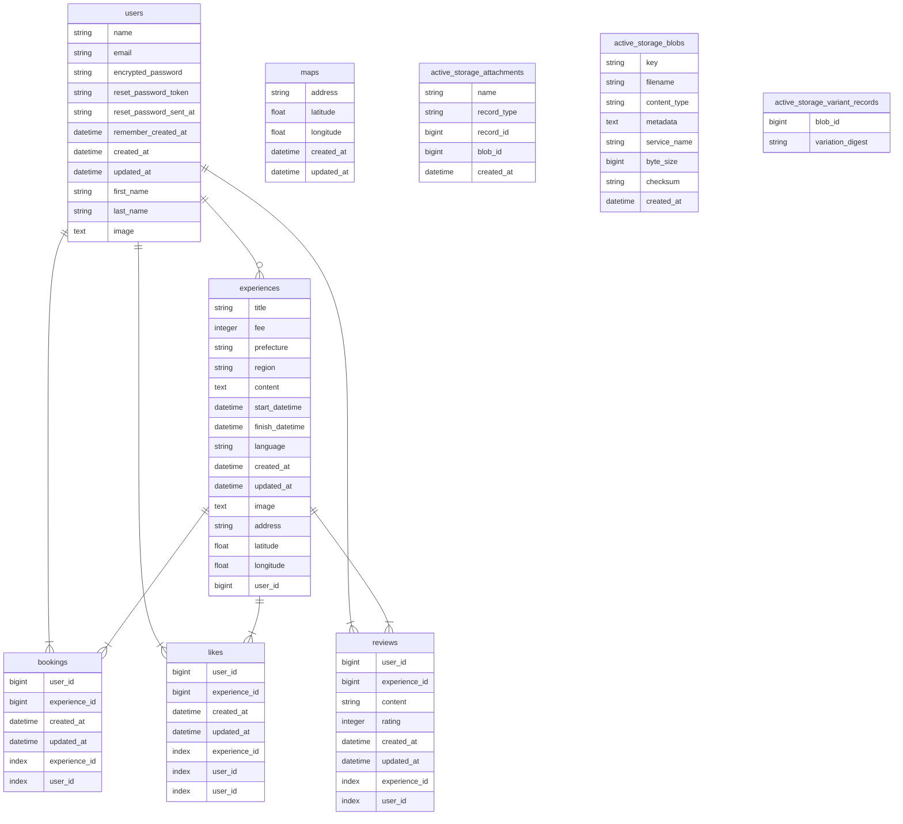

# Tearip（ティリップ）
茶摘み体験に特化した予約サービスです。
URL: https://tearip.com/
## 画面のイメージ

## アプリの概要
日本では、平地で機械摘みしている茶園が多いですが、なかには、傾斜地で手摘みしている茶園もあります。  
手摘みは、芽を見ながら、人の手で行われるので、とても時間と労力が掛かります。  
Tearipは、旅行者に楽しみながら茶摘みをしてもらい、「お茶ファン」となってもらうことを目的とした、茶摘み体験に特化した予約サービスです。

## アプリの機能
- 体験検索機能（ransack）
- 体験予約機能
- 体験投稿機能
- お気に入り登録機能（非同期処理）
- GoogleMap表示機能（GoogleMap API）  
- 体験にコメントを付ける機能（raty）
- 認証機能（devise）  
- 画像投稿機能（S3,carrierwave）
- ページネーション機能（kaminari）
## 使用技術
- フロントエンド
    - HTML/CSS/Sass/Bootstrap
- バックエンド
    - Ruby(`2.6.5`→`3.1.1`)
    - Rails(`6.0.3.4`→`6.1.6.1`)
- インフラ
    - GitHub Actions(CI/CD)
        - CI: Rubocop/RSpecを使った自動テスト
        - CD: ECR/ECSへの自動デプロイ、デプロイ完了後にSlackへ通知
    - Docker(20.10.17)/docker-compose(2.10.2)
    - Nginx(1.23.1)
    - PostgreSQL
    - AWS(ECS(Fargate)/ALB/ACM/S3/RDS/Route53/CloudWatch/VPC/IAM)
- その他使用ツール
    - Visual Studio Code
    - Slack
    - draw.io

## 使い方
1.画面右上の「ログイン」からテストユーザでログイン  
2.体験一覧ページから予約したい体験をクリック  
3.体験詳細ページから「予約する」をクリック  

## インストール
    $ git clone https://github.com/Takao-Yamasaki/tea_party
    $ cd tea_party
    $ docker-compose -f docker-compose-prod.yml up -d

## インフラ構成図

### 開発環境・本番環境について
開発環境に`Docker/docker-compose`を使用しており、以下のコンテナを使用しています。
- Webサーバーのコンテナ: Nginx
- アプリケーションのコンテナ: Ruby/Ruby on Rails
- DBのコンテナ: PostgreSQL(開発環境のみ)
### SSL証明書の発行について
- SSL証明を発行して、HTTPS化を実現するため、`ACM`を使用しました。ACMを使用するため、`ALB`を導入することにしました。
- `ALB`を使用していますが、現状では負荷分散やスケールアウトするほどのアクセスは見込まれないため、ECSのタスクは１つだけで稼働させています。
## DB設計
### ER図

### 各テーブルについて
| テーブル名                 | 説明                                          | 
| -------------------------- | --------------------------------------------- | 
| users                      | 登録ユーザーの情報                            | 
| experiences                | 体験の情報                                    | 
| bookings                   | 予約の情報                                    | 
| likes                      | 体験への「いいね！」の情報                    | 
| maps                       | 体験場所の緯度経度の情報                      | 
| reviews                    | 体験へのレビューの情報                        | 
| active_storage_attachments | ファイルアップロード（Active Storage）の情報  | 

## 苦慮した点
- Rails`6.0`系から`7.0`系へのアップグレード
    - 当初の開発時点では`6.0`系で開発していたのですが、当初の開発から期間が空いてしまったので、バージョンアップをする必要が出てきました。`6.0.3.4`→`6.1.6.1`→`7.0`へのバージョンアップを順次行なっていたのですが、`7.0`系から`Webpacker`が廃止されたため、移行するのに苦慮し、断念しました。今回の`7.0`系へのアップグレードについては、開発を進めるに当たって、絶対的な要件ではないため、今後の課題としたいです。
- 本番環境用のDockerfileの作成
    - 開発環境用のDockerfileは、比較的時間を掛けず作成することができたのですが、本番環境のDockerfileの作成には、Railsの開発環境と本番環境での挙動の違い(例えば、`bundle exec rails assets:precompile`が自動実行されないなど)を理解できておらず、原因を突き止めるのに、かなり時間を要してしまいました。
- ECS(Fargate)への手動デプロイ
    - `nginx.conf`の記述にあまり慣れていなかったため、設定の記述に悩まされました。また、`403`エラーとブラウザに表示された時には、ECSのエラーログも特段表示されなかったので、Nginxコンテナの問題かRailsコンテナの問題なのか、原因の切り分けするのに非常に時間が掛かり大変苦慮しました。
    こちらについては、Rails側でブラウザ上にエラーログを意図的に出すと、`db:create`されていないことがわかり、解決に至りました。
- ECS(Fargate)への自動テスト・自動デプロイ（CI/CD）
    - `GitHub Actions`を使用するのが初めてだったので、yamlファイルの記載方法に悩まされました。また、自動デプロイに当たっては、`IAM`の権限関係でエラーになることが多かったので、IAMの適切な権限設定についても、今後理解を深めていきたいです。
## 今後の実装予定
- Rails7系へのバージョンアップ
- 管理画面の実装
- 開発環境用と本番環境用の`Dockerfile`及び`docker-compose.yml`を統合
    - Dockerの設計思想は、`開発環境と本番環境の差異をできるだけなくす`ことなので、開発環境と本番環境とでできるだけ差異があってはならず、複数ファイルをメンテナンスしないといけないので、管理が煩雑になるのを防ぐため、統合したいです。
    - 開発環境用: `Dockerfile` / `docker-compose.yml`
    - 本番環境用: `Dockerfile.prod` / `Dockerfile.nginx` / `docker-compose-prod.yml`
- Rspecを使ったテストコードの追加
- レスポンシブデザインの実装  
